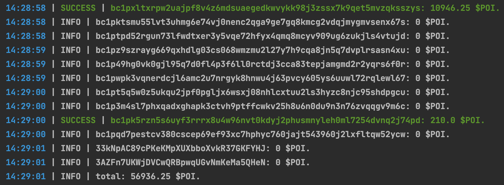

# POI-AIRDROP-CHECKER

this script checks your claimable balance of the [$POI airdrop](https://orcmarket.xyz/poi/). 
[donations are welcome](https://cyberomanov.tech/WTF_donate), if you find this tool helpful.

## Screenshots

Log example:

## Installation
1. make sure you have installed `python3.10` or newer;
2. setup your `data/address.txt`;
3. install requirements `pip3 install -r requirements.txt`;
4. run the script `python3 checker.py`.

## Update
1. `cd poi-airdrop-checker`
2. `git fetch && git pull`
3. `pip3 install -r requirements.txt`
4. `python3 checker.py`